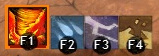

# Tempest Profession Mechanics
Tempest is one of the elite specializations of Elementalist.
Like the Elementalist a Tempest can switch between four different attunements.

|F1|  | [Fire Attunement](https://wiki.guildwars2.com/wiki/Fire_Attunement) |
|F2|  | [Water Attunement](https://wiki.guildwars2.com/wiki/Water_Attunement) |
|F3|  | [Air Attunement](https://wiki.guildwars2.com/wiki/Air_Attunement)|
|F4|  | [Earth Attunement](https://wiki.guildwars2.com/wiki/Earth_Attunement) |

It extends the Elementalist profession mechanic by adding Overload Skills (one for each
attunement) which become available after staying 6s[^Overload-CD] in one attunement.

This is how the toolbar will look like for a Tempest after spending some seconds in
Fire Attunement.

F1 is replaced with the skill [Overload Fire](https://wiki.guildwars2.com/wiki/Overload_Fire).
All other attunement selectors (F2, F3 and F4) have no cooldown.

When switching from one attunement into another (for instance from fire into water) the following
happens:

1. The attunement we switch out of will go on an at least 10s long cooldown. If an Overload skill
   has been used and its cooldown did exceed 10s then the cooldown of the overload skill will be
   used instead.
2. For the attunement we switch into the Overload skill will become available after a 6s[^Overload-CD]
   cooldown.
3. All other attunments will be given a cooldown of at least 2s. If they are already on a longer
   cooldown the cooldown will not be altered.

The following GIF shows the attunement switch from water into fire.

 Notice the game rending
the availability cooldown of [Overload Fire](https://wiki.guildwars2.com/wiki/Overload_Fire) to
appear less than 6s. For all other overload skills the game clearly renders "6" as initial cooldown.
But still, measuring the actual time confirms that the availability cooldown for all overload
skills is 6s.

[^Overload-CD]: The time necessary for an Overload skill to become available is 6s. Traits like
  [Pyromancer's Training](https://wiki.guildwars2.com/wiki/Pyromancer%27s_Training) or
  [Aquamancer's Training](https://wiki.guildwars2.com/wiki/Aquamancer%27s_Training) will not
  shorten the availability cooldown of [Overload Fire](https://wiki.guildwars2.com/wiki/Overload_Fire)
  or [Overload Water](https://wiki.guildwars2.com/wiki/Overload_Water).
